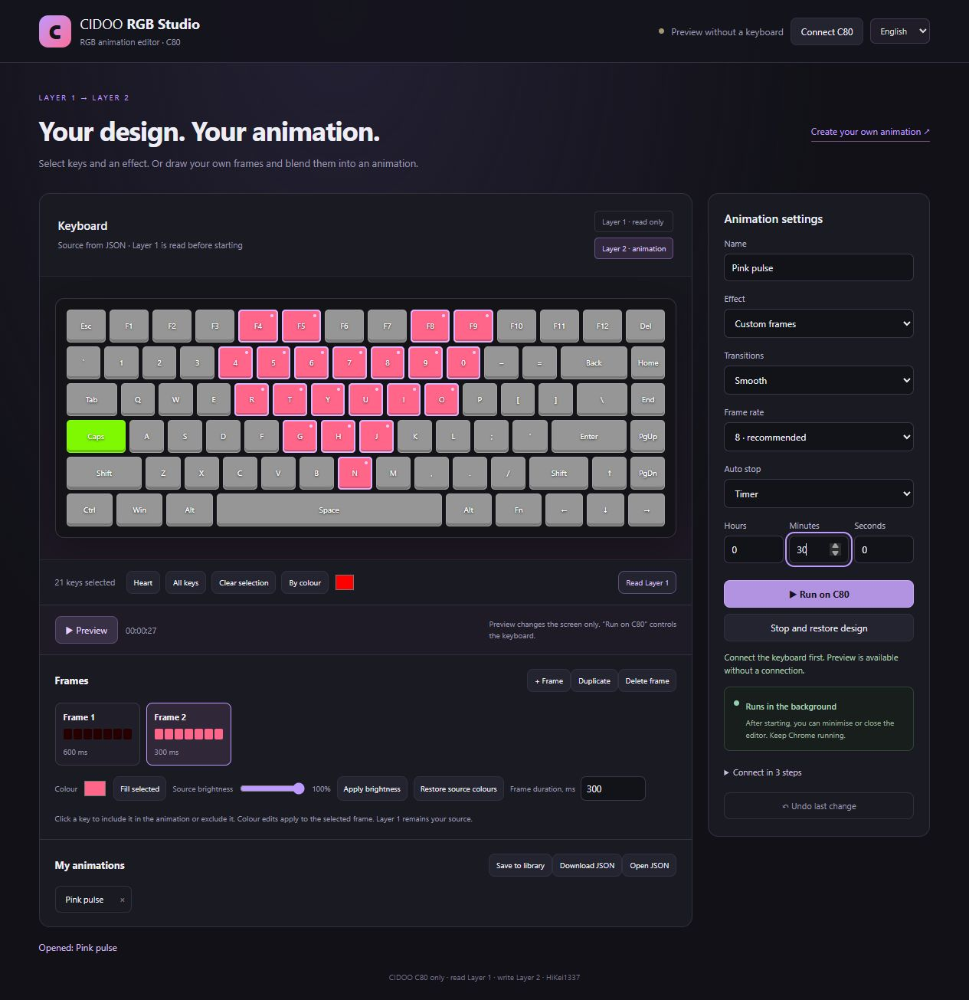
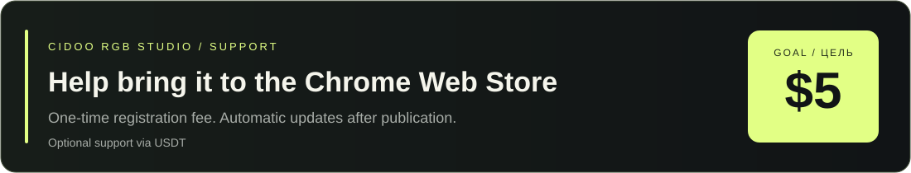

# CIDOO RGB Studio — Keyboard Animations

Language / Язык: [Русский](README.md) · **English**<br>
[Landing page](https://hikei1337.github.io/cidookeyboardanimations/) · [Workshop Lite](https://hikei1337.github.io/cidookeyboardanimations/workshop.html) · [Create your own animation](docs/CUSTOM_ANIMATION.en.md) · [Download v1.6.1 release](https://github.com/HiKei1337/cidookeyboardanimations/releases/download/v1.6.1/cidoo-rgb-studio-v1.6.1.zip)

The landing page chooses a language automatically: Russian for `ru-*` browsers and English for everyone else.

A Chrome extension for **CIDOO RGB keyboard animations**. It reads your design from **Layer 1** and animates it on **Layer 2**, including when the CIDOO tab or Chrome window is minimised.



## Features

- Heartbeat, breathing, colour shimmer and combined effects.
- Full-keyboard presets: blooming flowers, northern lights, comet and fireflies.
- Visual keyboard editor with key selection, colour editing, custom frames and smooth or instant transitions.
- Animation library, draft autosave, JSON import and export.
- **Never** mode or an optional hours/minutes/seconds timer.
- Background USB control: close the editor and CIDOO tab after starting.
- English and Russian UI, with RU / ENG buttons at the top of the editor or popup.
- Choose whether stopping keeps the last frame, restores prior Layer 2 lighting or copies the Layer 1 source.

**The extension never writes colours to Layer 1. All colour writes target Layer 2.**

## Installation

Requirements: CIDOO, a USB connection and Chrome 117 or newer. Other models are untested.

1. [Download the v1.6.1 release ZIP](https://github.com/HiKei1337/cidookeyboardanimations/releases/download/v1.6.1/cidoo-rgb-studio-v1.6.1.zip) and extract it.
2. Open `chrome://extensions` and enable **Developer mode**.
3. Click **Load unpacked** and choose the folder containing `manifest.json`.
4. Connect the keyboard to the [CIDOO website](https://cidoo.illumipc.com/#/), enable lighting and select **Custom → Layer 2**.
5. Open the extension → **Open animation editor** → **Connect keyboard**. In the separate connection tab, click **Select USB keyboard**, select the device in Chrome and confirm. Return to the editor.
6. Click **Read Layer 1**, choose keys and an effect, then **Run on keyboard**.

The website will show the device as disconnected after step 5. This is expected: the extension takes over USB control. Do not reconnect the website or another RGB controller while an animation is running.

## Update without downloading again (Windows)

1. Stop playback and close the editor.
2. Run **update.cmd** inside the installed extension folder. Press **Y**, then Enter to continue.
3. The script downloads the latest stable release from this repository, validates the archive and replaces files in the same folder. If you already have the latest version, it changes nothing.
4. Open `chrome://extensions` and click **Reload** on the CIDOO RGB Studio card. Do not remove or reinstall the extension: keeping the same installation preserves your settings and library.

For an older installation, download a release containing `update.cmd` once and extract it over your existing folder. Subsequent updates need no manual ZIP download. Requires Windows PowerShell 5.1 and GitHub access. Administrator privileges are not needed when the folder is writable. Other operating systems still require manual file updates.

Updates run when requested, not in the background. Chrome cannot automatically reload an unpacked extension. The script keeps a backup at the path printed in its window, leaves your own JSON files untouched and restores previous files if copying fails. It does not access Chrome's stored settings or projects.

When upgrading from version 1.0, also reload the CIDOO tab to remove its old animation script.

## Custom animations

Apply a preset effect to any selected keys, or draw your own frame sequence.

Example: **Custom frames → Frame 1 at 15% brightness → Duplicate → paint Frame 2 pink → Smooth transitions → Preview**.

See the illustrated step-by-step [no-code animation guide](docs/CUSTOM_ANIMATION.en.md). Ready-to-import JSON projects are in [examples](examples).

## Playback speed

The Workshop and editor have a **0.25x–4x** speed slider. It changes animation timing independently of frame rate and is preserved in exported JSON. Update to extension 1.6.0 to use it on the keyboard.

## Workshop Lite

The [Workshop page](https://hikei1337.github.io/cidookeyboardanimations/workshop.html) contains a small collection of ready-made JSON animations. Click **Open in editor** to load a preset immediately, or download the JSON file. Submit your animation on the website: enter a name, author and description, then attach its JSON file. Submissions are stored in Supabase and appear after approval by the owner.

**Preview** affects the screen only. **Run on keyboard** controls the device. The keyboard's real Layer 1 colours are read before each start; imported projects cannot overwrite Layer 1.

## Background operation and load

A Chrome extension service worker sends frames directly through WebHID. No page timers are used. The default is **8 frames/s**, with 4, 8, 12 and 20 available. Identical frames are skipped, buffers are reused, and no website rendering or settings writes happen on every frame.

**Never** runs until you stop it, without a session time limit. The timer stops the effect using the selected stop behaviour.

Keep Chrome running and the computer awake. Quitting Chrome, disconnecting USB or rebooting interrupts playback. Press **Stop** before quitting Chrome, otherwise the final frame may remain. Reconnect and copy Layer 1 → 2 to restore the source design if needed.

## Shortcuts

| Shortcut | Action |
|---|---|
| `Alt+Shift+H` | Start / stop the last selected animation |
| `Alt+Shift+S` | Stop using the selected behaviour |

Change shortcuts on `chrome://extensions/shortcuts`.

## Data and permissions

Settings, projects and the Layer 2 backup stay in local extension storage. The extension does not upload projects automatically or use external libraries. Submitting through the website sends your selected JSON, name, description and nickname to Supabase. Admin sign-in uses Supabase Auth. Imported JSON is data, never executable code.

Permissions: `storage` for local settings and projects; `scripting` and access to `cidoo.illumipc.com` to identify the keyboard and release the website's connection. Chrome separately asks for USB device permission.

## Status

This is an experimental, independent project, not an official CIDOO product. Compatibility depends on the device protocol and layout; support for every CIDOO model is unconfirmed. The editor has been browser-tested; background routing, timers, frames and Layer 1 protection have been tested with an HID simulator. Version 1.5.2 has not yet passed a full physical-keyboard test in Chrome.

The manufacturer does not document whether each custom colour frame is stored in flash. Endurance under long continuous playback is unconfirmed.

[Report an issue](https://github.com/HiKei1337/cidookeyboardanimations/issues) with Chrome and extension versions, keyboard model/firmware, the error message and steps to reproduce.

## Development

No build step or dependency installation. Tests require Node.js 18+:

```sh
npm test
```

See [docs/DEVELOPMENT.md](docs/DEVELOPMENT.md) for file roles and the project format.

## Support publication — $5 goal



The goal is **$5 for the one-time Chrome Web Store developer registration fee**. Once submitted and approved by Google, the extension can be installed from the store and receive automatic updates. Donations are optional; the GitHub version stays available.

**USDT donations. Use the matching network below.** [Copy addresses on the website](https://hikei1337.github.io/cidookeyboardanimations/#support).

| Network | USDT address |
|---|---|
| TRON · TRC20 | `TXcUdxdXRqYLf7PAe1KBvNF5vNEUe9oHiP` |
| TON | `UQARt7J7YyXQvAXSkuW-E8C4KBUDIgi7ILoLRv87dNMcxQxm` |
| Ethereum · ERC20 | `0xf393B0A1217fcA3d7C29973b4cA2d5e11E4465D3` |
| Solana | `H1e9Qhza8BeWgCpimmRb6eF2ZRdCn8SptwKyKwFnn3ZW` |

## Author and licence

Original author: [HiKei1337](https://github.com/HiKei1337).

[PolyForm Noncommercial 1.0.0](LICENSE) permits use and modifications for noncommercial purposes under its terms. Redistributed copies, including modified versions, must retain the licence and the `Required Notice:` lines in [NOTICE](NOTICE), including attribution to the original author. Commercial use requires separate permission from the author.

## GitHub Pages

The landing page is `docs/index.html`. Open repository **Settings → Pages → Deploy from a branch → main → /docs → Save**. Once published, the site will be available [here](https://hikei1337.github.io/cidookeyboardanimations/).
