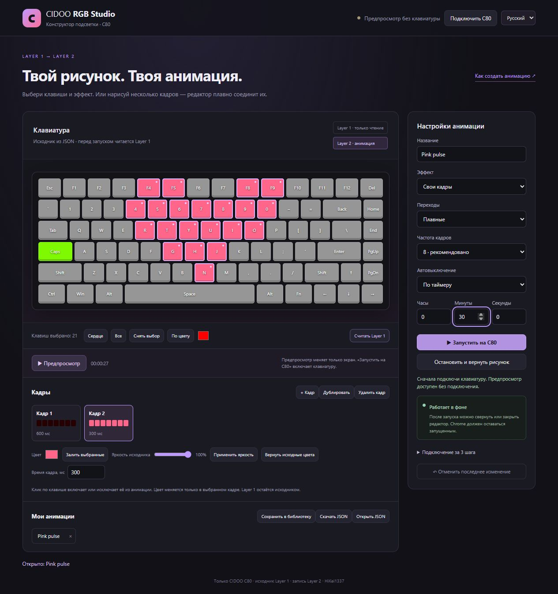

# CIDOO RGB Studio — Keyboard Animations

[Лендинг](https://hikei1337.github.io/cidookeyboardanimations/) · [English README](README.en.md) · [Как создать свою анимацию](docs/CUSTOM_ANIMATION.md) · [Скачать ZIP](https://github.com/HiKei1337/cidookeyboardanimations/archive/refs/heads/main.zip)

Расширение Chrome для анимации RGB-подсветки **CIDOO**. Читает рисунок из **Layer 1**, анимирует его в **Layer 2**. Работает в фоне, когда вкладка или окно Chrome свёрнуты.

CIDOO RGB animation editor / Chrome extension / WebHID / custom keyboard lighting.



## Что умеет

- Биение сердца, дыхание, переливание и их сочетание.
- Готовые шаблоны на всю клавиатуру: мигающий флаг России, цветы, северное сияние, комета, светлячки.
- Конструктор со схемой клавиатуры: выбор клавиш, цвета, свои кадры, плавные или мгновенные переходы.
- Библиотека анимаций, автоматическое сохранение черновика, импорт и экспорт JSON.
- Режим **Никогда** или таймер с часами, минутами и секундами.
- Фоновое управление через USB: редактор и вкладку сайта можно закрыть после запуска.
- Русский и английский интерфейс. Язык переключается вверху окна.
- Остановка возвращает во второй слой исходный рисунок из Layer 1.

**Layer 1 расширение не записывает. Все записи цветов идут только в Layer 2.**

## Установка

Нужны CIDOO, USB-подключение и Chrome 117 или новее. Другие модели не проверены.

1. [Скачай ZIP](https://github.com/HiKei1337/cidookeyboardanimations/archive/refs/heads/main.zip) и распакуй его.
2. Открой `chrome://extensions`, включи **Режим разработчика**.
3. Нажми **Загрузить распакованное расширение** и выбери папку с `manifest.json`.
4. На [сайте CIDOO](https://cidoo.illumipc.com/#/) подключи клавиатуру, включи подсветку и выбери **Пользовательский → Layer 2**.
5. Открой расширение → **Открыть конструктор анимации** → **Подключить клавиатуру**. В отдельной вкладке подключения нажми **Выбрать USB-клавиатуру**, выбери устройство в окне Chrome и подтверди. Вернись в редактор.
6. Нажми **Считать Layer 1**, выбери клавиши и эффект, затем **Запустить на клавиатуре**.

Сайт покажет отключение клавиатуры после шага 5. Это нормально: USB-управление передано расширению. Пока анимация работает, не подключай устройство обратно к сайту или другому RGB-контроллеру.

Для обновления останови анимацию, замени файлы расширения и нажми кнопку обновления на его карточке в `chrome://extensions`. После перехода с версии 1.0 обнови также вкладку CIDOO, чтобы удалить старый скрипт.

## Своя анимация

Можно выбрать готовый эффект для любых клавиш или нарисовать последовательность кадров.

Простой пример: **Свои кадры → Кадр 1 с яркостью 15% → Дублировать → Кадр 2 с розовым цветом → Плавные переходы → Предпросмотр**.

Полная инструкция с примерами: [Своя анимация без программирования](docs/CUSTOM_ANIMATION.md). Готовые проекты лежат в [examples](examples): скачай JSON и открой его в конструкторе.

**Предпросмотр** меняет только экран. **Запустить на клавиатуре** включает настоящую подсветку. Перед запуском читаются реальные цвета Layer 1; файл проекта не перезаписывает этот слой.

## Работа в фоне и нагрузка

Кадры отправляет фоновый процесс расширения через WebHID. Таймеры вкладки не используются. По умолчанию — **8 кадров/с**; доступны 4, 8, 12 и 20. Совпадающие кадры пропускаются, буферы используются повторно. На каждом кадре нет перерисовки сайта или сохранения настроек.

**Никогда** работает до ручной остановки без ограничения сеанса. Таймер останавливает эффект и возвращает рисунок по истечении заданного времени.

Chrome должен оставаться запущенным, компьютер — не спать. Закрытие всего браузера, отключение USB или перезагрузка прервут эффект. Перед выходом из Chrome нажми **Остановить**, иначе может остаться последний кадр. Для восстановления можно заново подключиться и скопировать Layer 1 → 2.

## Горячие клавиши

| Сочетание | Действие |
|---|---|
| `Alt+Shift+H` | Запустить / остановить последнюю выбранную анимацию |
| `Alt+Shift+S` | Остановить и вернуть рисунок |

Изменить сочетания: `chrome://extensions/shortcuts`.

## Данные и доступ

Настройки, проекты и резервная копия второго слоя хранятся локально в расширении. Аналитики, внешних библиотек и отправки проектов на сервер нет. JSON открывается как данные; код из него не исполняется.

Разрешения: `storage` — настройки и проекты; `scripting` и доступ к `cidoo.illumipc.com` — определить устройство и отключить сайт перед передачей управления. Доступ к USB-клавиатуре подтверждается отдельно в окне Chrome.

## Статус

Проект экспериментальный и независимый от CIDOO. Совместимость зависит от протокола и раскладки; работа на всех моделях CIDOO не подтверждена. Редактор проверен в браузере; фоновые команды, таймер, кадры и защита Layer 1 — на имитаторе HID. Версия 1.3 ещё не прошла полный тест на физической клавиатуре в Chrome.

Производитель не документирует, сохраняет ли прошивка каждый пользовательский кадр во flash-память. Ресурс при длительном непрерывном использовании не подтверждён.

Если нашёл проблему, [создай issue](https://github.com/HiKei1337/cidookeyboardanimations/issues): версия Chrome, версия расширения, модель/прошивка клавиатуры, текст ошибки и действия перед ней.

## Для разработчиков

Сборка и установка зависимостей не нужны. Для тестов нужен Node.js 18+:

```sh
npm test
```

Устройство записи жёстко использует второй слой. Формат проекта и устройство файлов описаны в [docs/DEVELOPMENT.md](docs/DEVELOPMENT.md).

## Автор и лицензия

Исходный автор: [HiKei1337](https://github.com/HiKei1337).

[PolyForm Noncommercial 1.0.0](LICENSE): использование и изменение разрешены для некоммерческих целей по условиям лицензии. При распространении исходной или изменённой версии сохраняй лицензию и строки `Required Notice:` из [NOTICE](NOTICE), включая указание исходного автора. Для коммерческого использования нужно отдельное разрешение автора.

## GitHub Pages

Лендинг находится в `docs/index.html`. В репозитории открой **Settings → Pages → Deploy from a branch → main → /docs → Save**. После публикации сайт будет доступен по [этому адресу](https://hikei1337.github.io/cidookeyboardanimations/).
