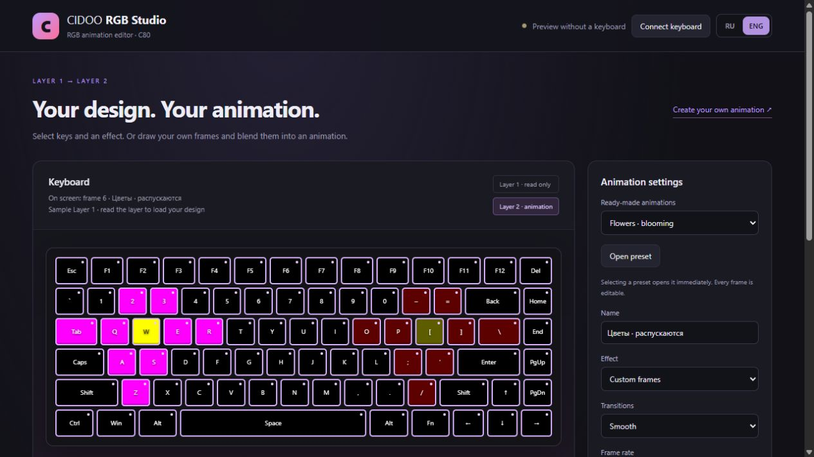
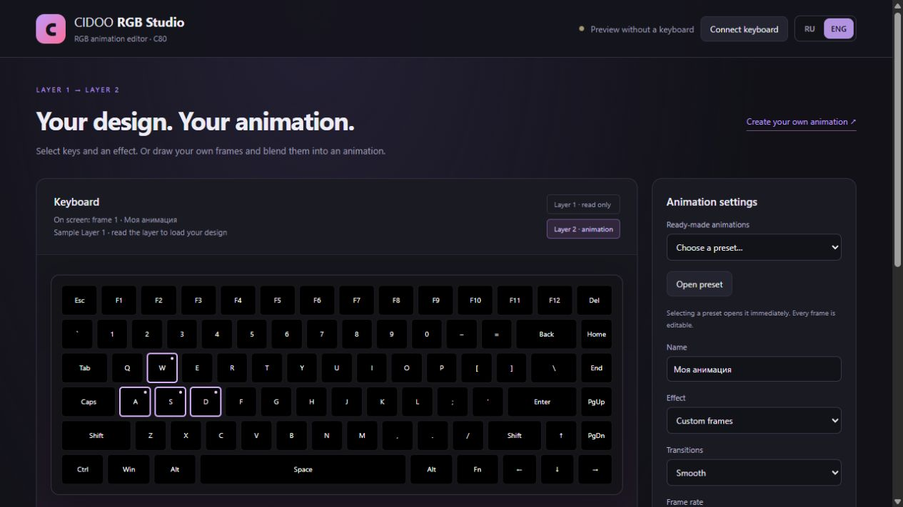
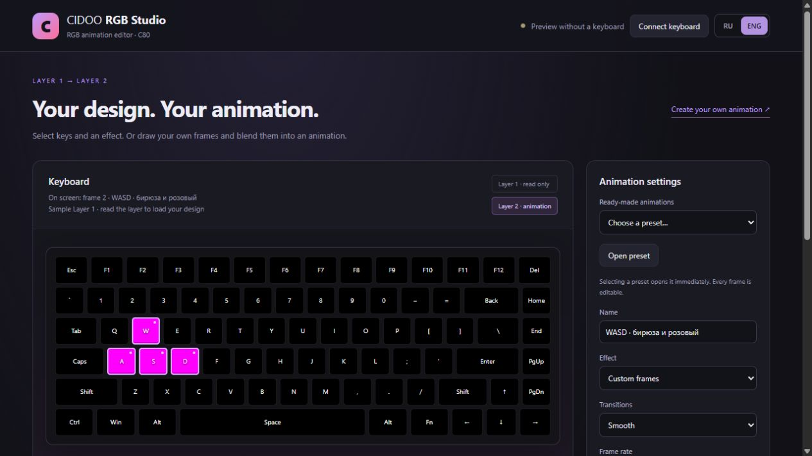
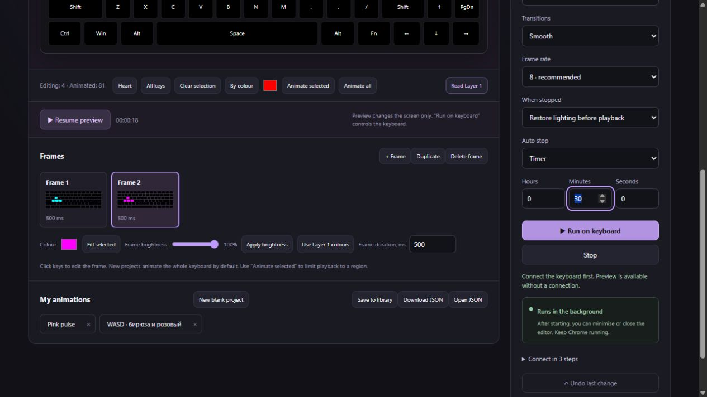
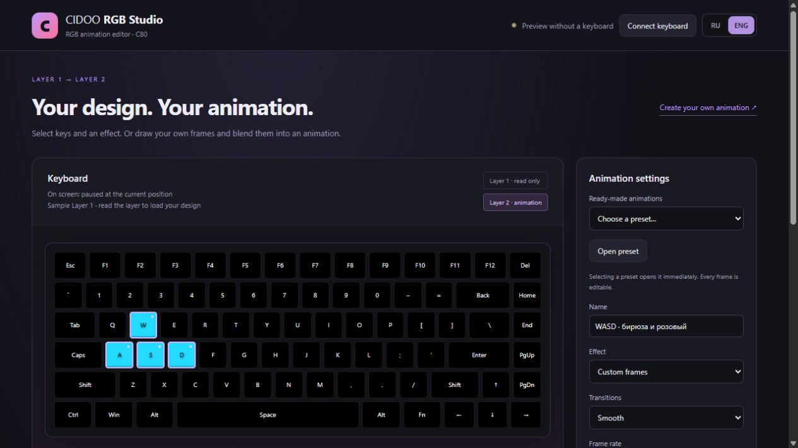

# Create your own animation — illustrated guide

[Русский](CUSTOM_ANIMATION.md) · [Back to README](../README.en.md)

For **version 1.4 and newer**. Screenshots use preview mode: you can draw without a keyboard. Real lighting needs the installed extension, USB and a compatible device protocol.

## 1. Know the editor

- **Left: keyboard.** It displays a frame or animation preview. The line below the heading tells you what is on screen.
- **Below the keyboard:** key selection and preview controls.
- **Frames:** each card shows a miniature of the whole keyboard and its duration.
- **Right:** project, presets, transitions, timer and hardware playback.
- **RU / ENG at the top right:** change language immediately. The active button is highlighted. Your project names remain as you wrote them.

**Layer 1** is the device design, which the extension only reads. **Layer 2** receives the animation. Projects and their frames are stored separately from the keyboard layers.

## 2. Try a preset

1. Under **Ready-made animations**, select **Flowers**, **Northern lights**, **Comet** or **Fireflies**. Selecting one opens the project immediately.
2. Click **Preview**. This changes the screen only.
3. Click **Pause**: the exact current colours stay on screen. The button changes to **Resume preview**.
4. Click a frame card to inspect or edit it. Its number appears below the keyboard heading.

**Open preset** reloads the original version of the selected preset. Use it to discard edits to that preset. **Undo last change** recovers the previous editing step.

The comet has a head and a fading tail. During its pass, the head changes from cold blue through orange to white. Every preset is an editable frame sequence.

## 3. Draw from scratch

We will make **W, A, S, D** blend from cyan to magenta, while the rest of the keyboard stays dark.

1. Under **My animations**, click **New blank project**. You get one black frame. Nothing on the device changes.
2. Name the project, for example `WASD — cyan and magenta`.
3. Click **Clear selection**, then click **W, A, S, D**. These four keys get a lilac outline.

### Painting selection and playback selection are separate

In **Custom frames**, the line below the keyboard has two numbers:

- **Editing:** the keys the fill and brightness tools will change.
- **Animated:** the keys that will receive frame colours on the device.

A new blank project animates the whole keyboard. Selecting four keys for painting does not bring back the Layer 1 heart on the other keys: they keep their black frame colours.

To animate only one part of a source design, select that region and click **Animate selected**. Other keys use Layer 1 during playback. **Animate all** applies the whole frame again.

In built-in **Heartbeat**, **Breathe** and **Shimmer** effects, outlines directly select animated keys. Those effects animate the Layer 1 design rather than painted frames.

## 4. Paint and build frames

1. Select **Frame 1**.
2. Choose cyan `#00ffff` in **Colour**: **RGB 0, 255, 255**.
3. Click **Fill selected**. W, A, S, D change; the other keys stay black.
4. Enter `600` in **Frame duration, ms**, then press Tab or click outside the field.
5. Click **Duplicate**. **Frame 2** opens with the same colours and duration.
6. Choose magenta `#ff00ff`: **RGB 255, 0, 255**. Click **Fill selected**.
7. Keep the second frame at `600` ms.

**Duplicate** copies colours and duration. **+ Frame** copies the current colours and gives the new frame a 400 ms duration. Neither button inserts the Layer 1 design.

**Frame brightness** changes the selected keys' current colours. Magenta 255/0/255 at 50% becomes 128/0/128. Moving back to 100% restores the colour from before the brightness adjustment. Black stays black: fill it first to add colour.

**Use Layer 1 colours** explicitly replaces selected frame colours with the source design. If Layer 1 contains a heart, this button brings those colours into the selected region.

Click a card before editing its colours. **Delete frame** removes the selected card, but at least one frame remains. You can have up to 120 frames.

## 5. Preview the motion

Choose **Smooth** under **Transitions**, then click **Preview**.

- Frame 1 blends into Frame 2 over 600 ms.
- Frame 2 blends back into Frame 1 over 600 ms.
- The full loop takes 1.2 seconds and repeats.

With **Instant**, each frame holds its colour for 600 ms and switches immediately. This suits blinking and distinct drawings.

Pausing preserves the exact colours between frames. Resuming continues from the same time. Clicking a frame card moves to that frame; the next preview starts there. Closing and reopening the editor preserves the selected frame and paused position.

Changing the name, timer or stop behaviour does not restart the preview. Painting colours or selecting a different frame moves the editor to the frame you are editing.

## 6. Run on the keyboard

1. On the [CIDOO website](https://cidoo.illumipc.com/#/), connect over USB, enable lighting and choose **Custom → Layer 2**.
2. In the extension, click **Connect keyboard**. A persistent connection tab opens.
3. If the extension already has USB permission, it reuses it automatically. Otherwise, click **Select USB keyboard** and select the device in Chrome. The website and extension have separate permissions.
4. Return to the editor. **Read Layer 1** updates the source for background colours and built-in effects. Painted frames and the selected card stay intact.
5. Choose **When stopped** and set a timer if needed.
6. Click **Run on keyboard**.

### What happens when playback stops

| Mode | Result in Layer 2 |
|---|---|
| **Keep last frame** — default | Motion stops; the current lighting remains. |
| **Restore lighting before playback** | Restores the Layer 2 snapshot taken before starting. |
| **Restore Layer 1** | Copies the Layer 1 source design to Layer 2. |

The same choice applies when the timer expires. **Never** has no session limit. **Timer** uses hours, minutes and seconds. The timer sets total playback time, not loop length.

Start with **8 frames/s**. 12 updates more frequently; 20 increases load. Editing a project does not change an animation already running on the device. Click Run again to apply your edits.

The website shows a disconnected device after handoff; this is expected. Do not reconnect it during extension playback. You can close the editor and website tab, but Chrome must stay running and the computer awake.

## 7. Save and share

Click **Save to library**. Your project appears as a button with its name. Saving with the same name updates that entry.

- **Download JSON:** a separate project file for backup or sharing.
- **Open JSON:** loads that file into the editor. Imported data is never executed as code.
- The **draft** saves automatically with the current frame. The library holds multiple projects.
- Removing the extension removes its local library. Export important projects first.

## If a heart appears again

1. Read **On screen**: is it a frame, source design or preview?
2. Check the effect: painted colours need **Custom frames**, not **Heartbeat**.
3. If it happens after stopping, choose **Keep last frame**.
4. If it appears behind an animation, click **Animate all**. Partial playback uses Layer 1 for other keys.
5. If an older project already contains incorrectly painted frames, reload the preset. Updates do not rewrite your saved artwork.
6. Reload the extension on `chrome://extensions`, then reload the editor tab. An open editor uses its old code until refreshed.

Physical compatibility depends on the device and protocol. Editor and HID simulator checks do not replace testing your keyboard. When reporting a problem in [GitHub Issues](https://github.com/HiKei1337/cidookeyboardanimations/issues), include extension version, model, message and reproduction steps.

## Key reactions (1.7.0)

1. Open **Key ripple** or any other animation.
2. Under **Key reactions**, choose flash, ripple or heat trail. Pick an RGB colour, a fade time from 0.2 to 3 seconds and strength from 10 to 100%.
3. Enable **Test keys on the diagram**. Clicking a key now triggers the effect without changing your selection. Physical keys work too, while focus is outside a settings input.
4. Run the project on the keyboard. For reactions on a website, open the extension popup from that tab and click **Connect key presses from this tab**. Connect each tab individually.
5. Click **Disconnect website key presses** in the popup to stop capture. Stopping playback also disables processing.

Reaction settings are saved in the project JSON. The selected colour temporarily blends over the base animation, then fades away. Layer 1 stays untouched. This feature does not capture input from other Windows applications.
[Illustrated guide: frames, colours, transitions and key reactions](https://hikei1337.github.io/cidookeyboardanimations/workshop.html#guide). With Custom frames, Beat on key press uses frame one as the drawing.

### Motion on key press

Select Directional wave, Key cross or Snake trail. Adjust direction, motion speed (1–30), trail length (1–12), lifetime (0.2–15 seconds), RGB colour and strength. Snake travels through rows (Right/Left) or columns (Up/Down); Both ways is supported by Wave and means forward for Snake.

For a custom sequence, draw frames and select My frames on key press. Frame one is rest, a press plays the sequence once, then returns to frame one. Choose Restart or Wait until finished. Frame duration, transitions and speed control playback; reaction fade, colour and strength are unused. All settings persist in JSON. Explicitly connect a Chrome tab; input from games and other apps is not captured.

### Cycling flowers, bursts at the pressed key and rules

- Typing flowers cycles through one flower per press. To build your own, select the first flower → Add selected as a group; repeat for the others, enable Cycle through groups and Beat on key press. Minimum brightness 0 turns flowers off at rest. Quick presses may overlap flashes from different groups.
- Cross, Wave and Snake always start at the pressed key. For custom frames, select From the pressed key and choose Drawing centre, the key you drew your burst around. The drawing moves to the pressed key and clips at layout edges. Existing black and background colours are preserved. Start with a black resting frame for this mode.
- Advanced · keys and combos is off by default. Enter a key (Q) or sequence (E E W), choose matching order and a response preset → Add rule → Enable key rules. Current project binds a copy of your own frames and settings. Delete and recreate a rule to replace that copy. Keep or disable the normal reaction for unmatched presses.
- Combo window: 0.2–5 seconds; up to 4 keys and 12 rules. Longest matching rule wins, with list order breaking ties. The latest match replaces the previous effect. Duplicate letters count. Any order means consecutive input in any order, not simultaneous held keys.
- Invoker · combos: EEW falling/rolling meteor, WWQ cold upward wave, QQQ icy cross, QWE split wave. These are RGB demos in the editor and connected Chrome tabs. The extension cannot receive input from Dota 2 or other Windows programs.

### All Invoker spells

10 effects and all 27 input variations, including orb permutations. The Workshop has a combined rules preset and one editable preset per spell. These are stylised RGB animations, not a Dota 2 integration. Input is Chrome-only in this version. Three orbs trigger the effect directly; R is not required.

| Q/W/E | Spell |
|---|---|
| QQQ | Cold Snap |
| QQW | Ghost Walk |
| QQE | Ice Wall |
| WWW | E.M.P. |
| WWQ | Tornado |
| WWE | Alacrity |
| EEE | Sun Strike |
| EEQ | Forge Spirit |
| EEW | Chaos Meteor |
| QWE | Deafening Blast |

[Official Dota 2 Invoker](https://www.dota2.com/hero/invoker) · [Recipe reference](https://dota2.tools/tools/invoker-game)
