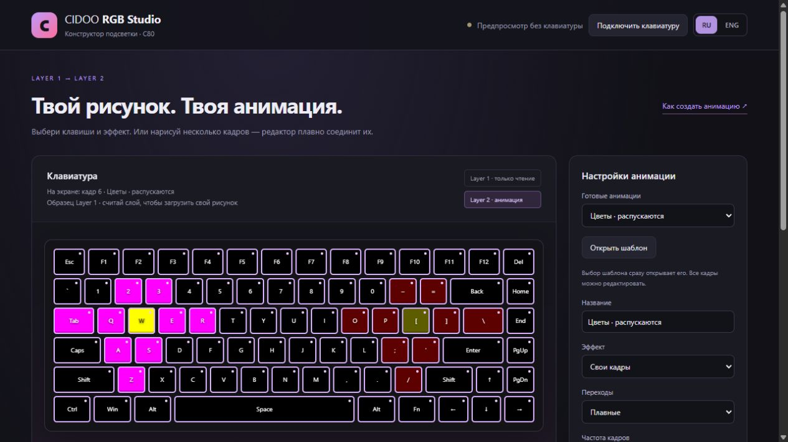
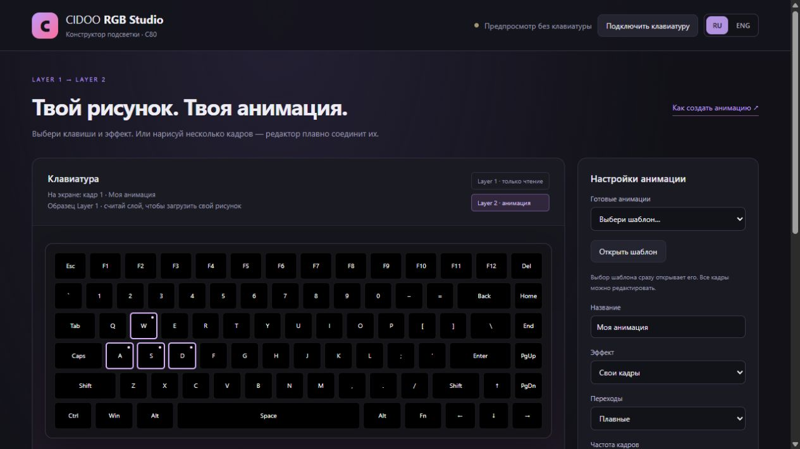
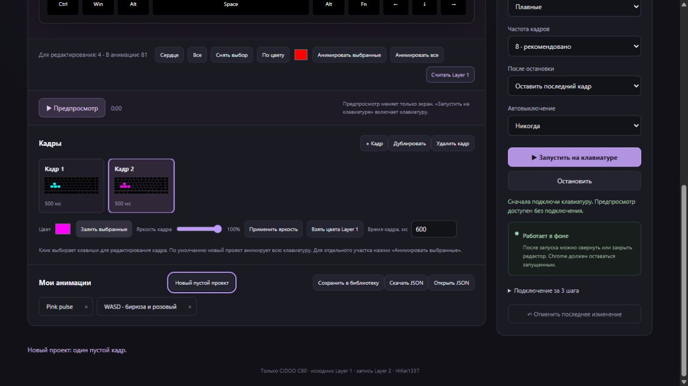
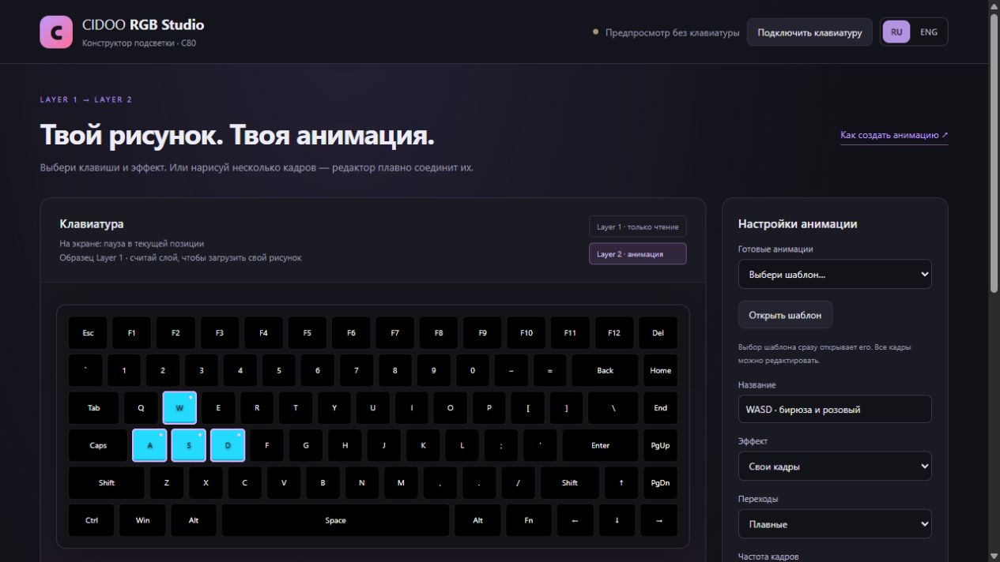
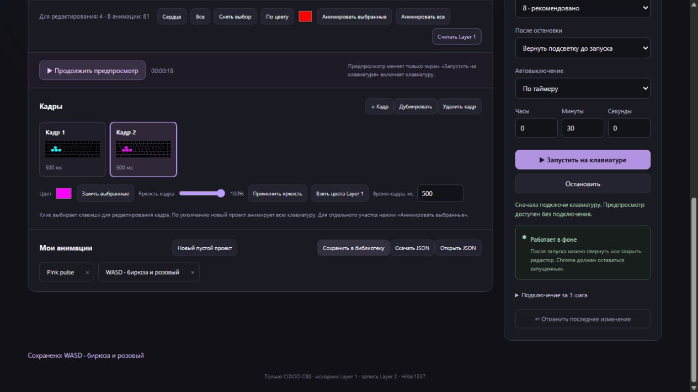

# Как сделать свою анимацию — подробный гайд

[English guide](CUSTOM_ANIMATION.en.md) · [Вернуться к README](../README.md)

Инструкция для версии **1.4 и новее**. Скриншоты сняты в режиме предпросмотра: для рисования клавиатура не нужна. Для настоящей подсветки понадобится установленное расширение, USB-подключение и совместимый протокол устройства.

## 1. Разобраться в окне

- **Слева — клавиатура:** показывает выбранный кадр или движение в предпросмотре. Под заголовком написано, что именно сейчас на экране.
- **Под клавиатурой — выбор клавиш и предпросмотр.**
- **Ниже — кадры:** каждый имеет миниатюру всей клавиатуры и длительность.
- **Справа — проект, готовые шаблоны, переходы, таймер и запуск устройства.**
- **RU / ENG вверху справа** переключает язык сразу. Активная кнопка подсвечена. Названия твоих проектов остаются такими, как ты их написал.

**Layer 1** — рисунок на устройстве, который расширение может только читать. **Layer 2** — слой, в который отправляются анимации. Проекты и кадры хранятся отдельно от слоёв клавиатуры.

## 2. Попробовать готовый шаблон

1. В **Готовых анимациях** выбери **Цветы**, **Сияние**, **Комету** или **Светлячков**. Выбор сразу открывает проект.
2. Нажми **Предпросмотр**. Устройство при этом не меняется.
3. Нажми **Паузу**: изображение останется в текущей позиции, а кнопка станет **Продолжить предпросмотр**.
4. Чтобы посмотреть конкретный кадр, нажми его карточку. Под заголовком появится номер кадра.

Кнопка **Открыть шаблон** заново загружает исходную версию выбранного шаблона. Используй её, если хочешь отменить свои правки шаблона. Последнее действие можно вернуть кнопкой **Отменить последнее изменение**.

Комета имеет голову и затухающий хвост. В течение прохода её голова меняет цвет от холодного голубого через оранжевый к белому. Любой шаблон можно редактировать как обычный набор кадров.

## 3. Нарисовать своё с нуля

Сделаем четыре клавиши **W, A, S, D**, которые плавно меняются с бирюзового на розовый. Остальная клавиатура будет тёмной.

1. В блоке **Мои анимации** нажми **Новый пустой проект**. Появится один чёрный кадр; чужие рисунки на устройстве не меняются.
2. В поле **Название** напиши, например, `WASD · бирюза и розовый`.
3. Нажми **Снять выбор**, затем кликни **W, A, S, D** на схеме. У этих четырёх клавиш появится лиловая рамка.

### Выбор для рисования и выбор для анимации — разные вещи

В режиме **Свои кадры** строка под клавиатурой показывает два числа:

- **Для редактирования** — какие клавиши сейчас перекрасит кнопка заливки или яркости.
- **В анимации** — какие клавиши будут получать цвета кадров на устройстве.

Новый пустой проект анимирует всю клавиатуру. Поэтому выбор четырёх клавиш для заливки не возвращает на остальные клавиши сердце из Layer 1: они сохраняют чёрный цвет своего кадра.

Если нужно анимировать только часть рисунка, выбери участок и нажми **Анимировать выбранные**. Остальные клавиши при воспроизведении возьмут цвета Layer 1. **Анимировать все** снова включает весь кадр.

В готовых эффектах **Биение**, **Дыхание** и **Переливание** рамки сразу задают клавиши анимации: эти эффекты меняют рисунок Layer 1, а не нарисованные кадры.

## 4. Задать цвета и собрать кадры

1. Выбери **Кадр 1**.
2. В поле **Цвет** выбери бирюзовый `#00ffff`, то есть **RGB 0, 255, 255**.
3. Нажми **Залить выбранные**. Перекрасятся W, A, S, D; остальные клавиши останутся чёрными.
4. В **Время кадра, мс** введи `600` и нажми Tab или кликни вне поля.
5. Нажми **Дублировать**. Откроется **Кадр 2**, точно такой же, как первый.
6. Выбери розовый `#ff00ff` — **RGB 255, 0, 255** — и нажми **Залить выбранные**.
7. Оставь длительность второго кадра `600` мс.

**Дублировать** копирует цвета и время. **+ Кадр** копирует цвета текущего кадра и даёт новому кадру длительность 400 мс. Ни одна из этих кнопок не подставляет рисунок Layer 1.

**Яркость кадра** меняет текущие цвета выбранных клавиш. Например, розовый 255/0/255 на 50% станет 128/0/128. Если затем поставить 100%, вернётся цвет до изменения яркости. Чёрный цвет остаётся чёрным — для него сначала нужна заливка.

**Взять цвета Layer 1** — отдельная явная команда: она заменяет выбранные цвета кадра цветами исходника. Если в Layer 1 нарисовано сердце, именно эта кнопка вернёт его цвета на выбранный участок.

Карточка кадра выбирает место редактирования. **Удалить кадр** удаляет выбранную карточку, но один кадр всегда остаётся. Поддерживается до 120 кадров.

## 5. Посмотреть движение

В **Переходах** выбери **Плавные**, затем нажми **Предпросмотр**.

- Сначала цвет первого кадра за 600 мс переходит в цвет второго.
- Затем второй за 600 мс переходит обратно в первый.
- Весь цикл занимает 1,2 секунды и повторяется.

При выборе **Без перехода** цвет держится 600 мс, затем переключается сразу. Это подходит для мигания и последовательности чётких рисунков.

Пауза сохраняет точные цвета между кадрами. Продолжение идёт с того же времени. Нажатие карточки кадра переводит просмотр на эту карточку; следующий предпросмотр начинается с неё. После закрытия и открытия редактора сохраняются выбранный кадр и позиция паузы.

Изменение имени, таймера или поведения после остановки не возвращает просмотр в начало. Правка цветов или выбор другого кадра переводит редактор к кадру, который ты редактируешь.

## 6. Запустить на клавиатуре

1. На [сайте CIDOO](https://cidoo.illumipc.com/#/) подключи клавиатуру по USB, включи подсветку и выбери **Пользовательский → Layer 2**.
2. В расширении нажми **Подключить клавиатуру**. Откроется постоянная вкладка подключения.
3. Если расширение уже имеет USB-разрешение, оно использует его автоматически. Иначе нажми **Выбрать USB-клавиатуру** и выбери устройство в окне Chrome. Разрешение сайта и расширения раздельные.
4. Вернись в редактор. **Считать Layer 1** обновит исходник для фона и готовых эффектов. Цвета нарисованных кадров и выбранная карточка сохранятся.
5. Выбери **После остановки** и настрой таймер.
6. Нажми **Запустить на клавиатуре**.

### Что произойдёт при остановке

| Режим | Результат в Layer 2 |
|---|---|
| **Оставить последний кадр** — по умолчанию | Движение прекращается, текущая подсветка остаётся. |
| **Вернуть подсветку до запуска** | Возвращается снимок Layer 2, сделанный перед запуском. |
| **Вернуть Layer 1** | Во второй слой копируется исходный рисунок первого. |

Тот же выбор действует при истечении таймера. **Никогда** — без лимита времени, до ручной остановки. **По таймеру** — часы, минуты и секунды. Таймер задаёт время работы, а не длину повторяющегося цикла.

Оставь **8 кадров/с** для начала. 12 даёт более частые обновления, 20 повышает нагрузку. После изменения проекта во время реального воспроизведения нажми запуск снова: устройство получает настройки, которые были на момент запуска.

После передачи управления сайт покажет отключение — это ожидаемо. Не подключай его обратно во время работы расширения. Вкладку и редактор можно закрыть, но Chrome должен работать, а компьютер — не спать.

## 7. Сохранить результат

Нажми **Сохранить в библиотеку**. Проект появится кнопкой с твоим названием. Повторное сохранение с тем же названием обновляет эту запись.

- **Скачать JSON** — получить отдельный файл проекта для резервной копии или другого пользователя.
- **Открыть JSON** — загрузить такой файл в редактор. Код из файла не исполняется.
- **Черновик** сохраняется автоматически вместе с текущим кадром. Библиотека нужна для нескольких отдельных проектов.
- Удаление расширения удаляет его локальную библиотеку. Важные проекты экспортируй заранее.

## Если снова видишь сердце

1. Посмотри строку **На экране**: показан кадр, исходник или предпросмотр?
2. Проверь эффект: для своих цветов нужен **Свои кадры**, а не **Биение**.
3. Если рисунок появляется только после остановки, проверь **После остановки**. Выбери **Оставить последний кадр**.
4. Если сердце видно на фоне движения, нажми **Анимировать все**. При частичной анимации остальная подсветка берётся из Layer 1.
5. Если старый проект уже содержит ошибочно перекрашенные кадры, открой шаблон заново. Обновление программы не переписывает сохранённые работы.
6. Обнови расширение на `chrome://extensions` и перезагрузи открытую вкладку конструктора: старый редактор продолжает использовать старый код до обновления страницы.

Физическая совместимость зависит от устройства и протокола. Проверка редактора и HID-симулятора не заменяет испытание на конкретной клавиатуре. При ошибке укажи в [GitHub Issues](https://github.com/HiKei1337/cidookeyboardanimations/issues) версию расширения, модель, сообщение и действия перед ошибкой.
